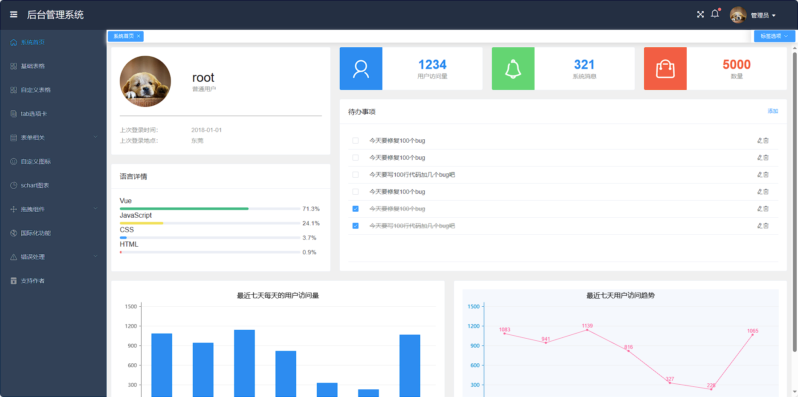
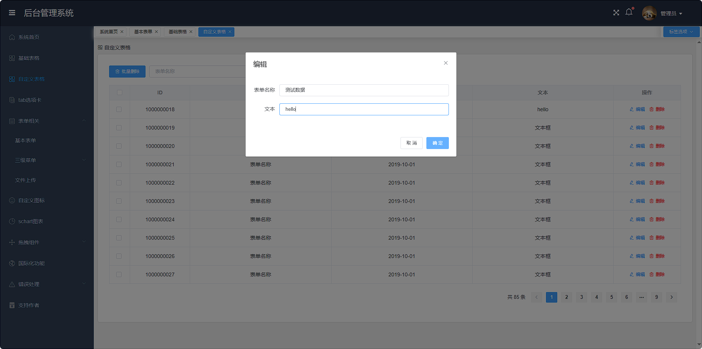
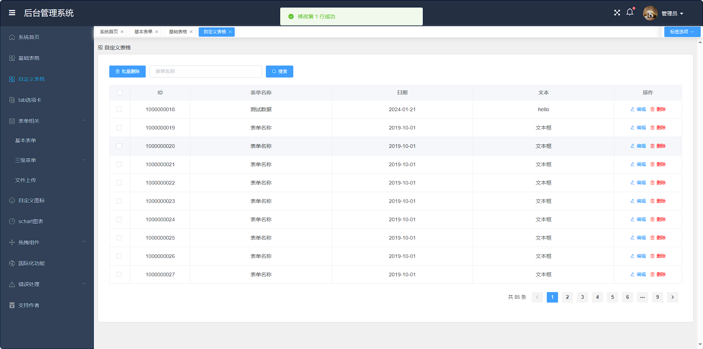

# manager
## 项目效果图





## 这是一个管理后台Demo的前后端代码
```
前端技术 vue element
后端技术 springboot mybatis-plus
数据库 mysql redis

工程目录有初始化sql脚本

需要配置好 mysql redis 即可启动

初始账号密码 root/root
```
## 前端启动步骤
```
// 进入模板目录
cd vue-manage-system
// 安装项目依赖，等待安装完成之后，安装失败可用 cnpm 或 yarn
npm install
// 开启服务器，浏览器访问 http://localhost:8080
npm run serve
// 执行构建命令，生成的dist文件夹放在服务器下即可访问
npm run build
```

## 特别鸣谢 前端代码
```
https://github.com/lin-xin/vue-manage-system
```

## 如有侵权，请联系 355528003@qq.com
